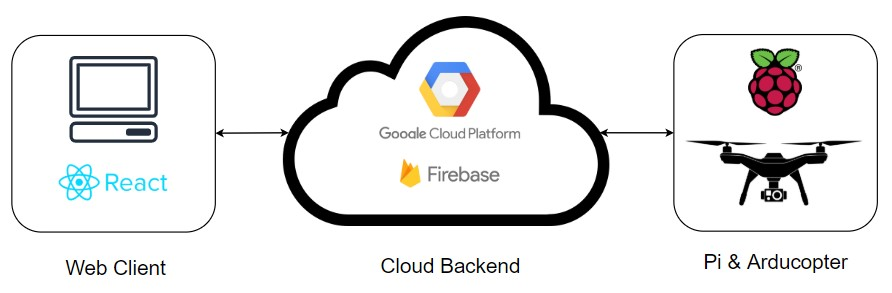
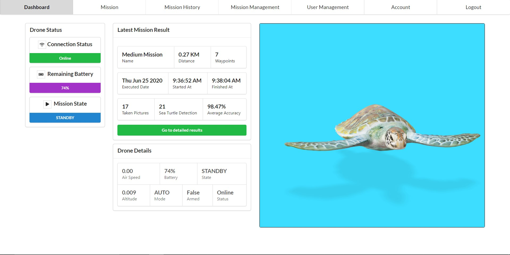
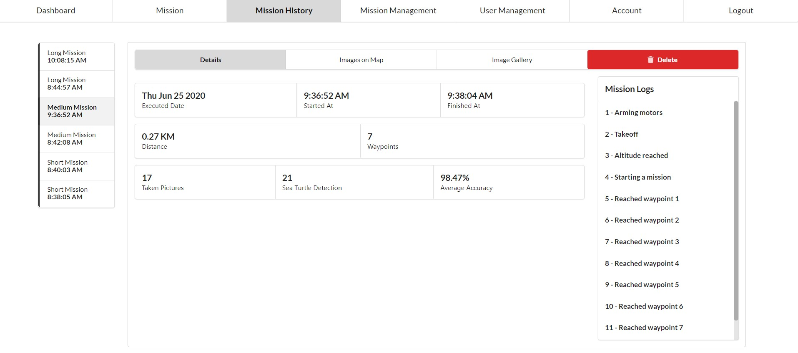
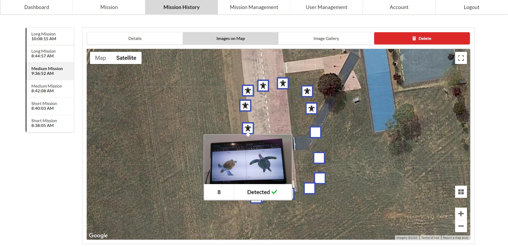
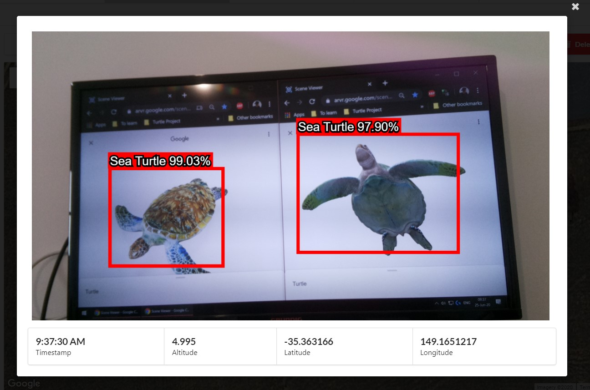
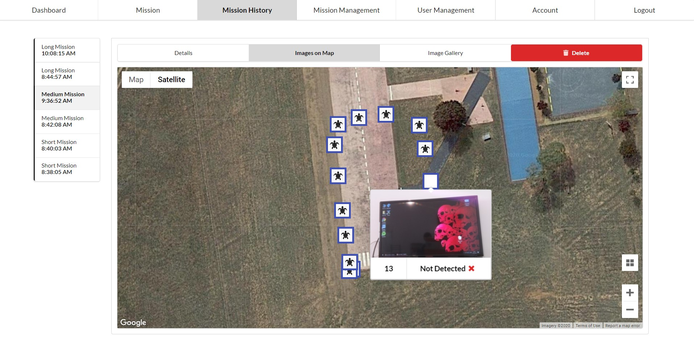
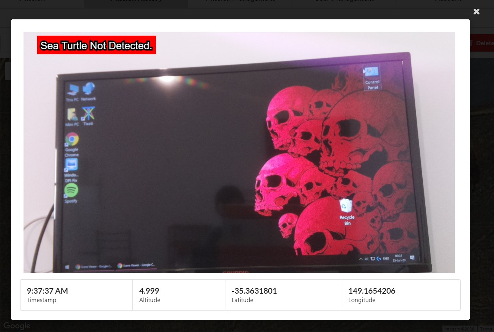
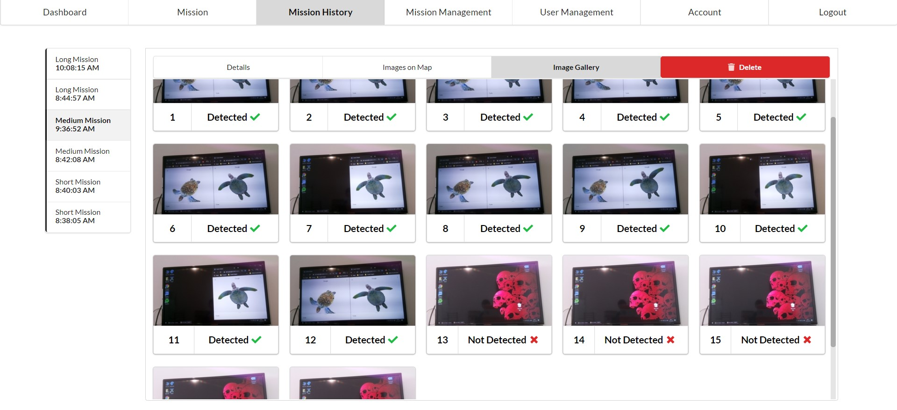

# Airborne Coast Monitoring System for Sea Turtle Detection and Species Classification

## Graduation Project of [Arslan Charyyev](https://github.com/arslan-charyyev) and [Oguzhan Ergun](https://github.com/uid4oe) - July 2020

 

## Features

Real-time mission tracking, real-time updates, mission management (crud) with gmaps integration, mission history management, user management, various serverless functions for trigger based operations

### Used Firebase Modules: Real-time DB, Firestore, Storage, Hosting, Auth, ML Kit

#### Dashboard

#### Mission Management Page (CRUD) - Demo

#### Mission Execution Page - Demo

#### Mission History Page

